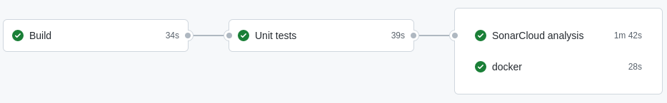

[](https://sonarcloud.io/dashboard?id=softwarejimenez_mowers)

# mowers

Application to control mowers through an API.

## Goal

- Develop an application that helps in controlling mowers.
    - The mowers are able to cut the grass and to inspect the terrain with their cameras to identify problems in the
      green areas.
- A green grass plateau must be navigated by the mowers, so they can cut the grass.

## Details

- The plateau is rectangular and is divided up into a grid to simplify navigation.
- A mower’s position and location are represented by:
    - Combination of X and Y coordinates
    - A letter representing one of the four cardinal compass points (N, E, S, W).
- Control a mower by sending a string of letters.
    - The possible letters are “L”, “R” and ”M”.
        - “L” and “R” make the mower spin 90 degrees left or right respectively, without moving from its current spot.
        - “M” means to move forward one grid position and maintain the same Heading.

## API

### Plateau

#### POST `/plateau`

- Description: Create a plateau
- Header: `Content-Type: application/json`
- Body:
  ```json
  { 
      "upperRightXCoordinate" :10,
      "upperRightYCoordinate" :22
  }
   ```
- Response
    - Status: 201 CREATED
        - Location: `http://localhost:8080/plateau/b9406067-4d3e-4210-93d1-5db05e9b939d`
        - Body `application/json`::
          ```json
          {
              "upperRightXCoordinate" :10,
              "upperRightYCoordinate" :22
          }
          ```
    - Status: 409 CONFLICT
- Example
  ```
    curl --location --request POST 'http://localhost:8080/plateau' \
        --header 'Content-Type: application/json' \
        --data-raw '{
            "upperRightXCoordinate": 10,
            "upperRightYCoordinate": 22
        }'
  ```

#### GET `/plateau/{id}`

- Description: Get the plateau by Id
- Response
    - Status: 200 Ok
        - Body `application/json`::
            ```json
                {
                    "upperRightYCoordinate" :10,
                    "upperRightYCoordinate" :22
                }
            ```
    - Status: 404 Not Found
- Example
  ```
    curl --location --request GET 'http://localhost:8080/plateau/b9406067-4d3e-4210-93d1-5db05e9b939d'
  ```

### Mower

#### POST `/mower`

- Description: Create a mower
- Header: `Content-Type: application/json`
- Body:
  ```json
    {
        "plateauId": "b9406067-4d3e-4210-93d1-5db05e9b939d",
        "position": {
            "x": 5,
            "y": 6
        },
        "orientation": "N"
    }
   ```
- Response
    - Status: 201 CREATED
        - Location: `http://localhost:8080/mower/b9406067-4d3e-4210-93d1-5db05e9b939d`
            - Body `application/json`: 
              ```json
                {
                    "plateauId": "b9406067-4d3e-4210-93d1-5db05e9b939d",
                    "position": {
                        "x": 5,
                        "y": 6
                    },
                    "orientation": "N"
                }
              ```
    - Status: 409 CONFLICT
- Example
  ```
    curl --location --request POST 'http://localhost:8080/mower' \
        --header 'Content-Type: application/json' \
        --data-raw '{
            "plateauId": "b9406067-4d3e-4210-93d1-5db05e9b939d",
            "position": {
                "x": 5,
                "y": 6
            },
            "orientation": "N"
        }'
  ```

#### GET `/mower/{id}`

- Description: Get the mower by Id
- Response
    - Status: 200 Ok
        - Body `application/json`:
          ```json
            {
                "plateauId": "b9406067-4d3e-4210-93d1-5db05e9b939d",
                "position": {
                    "x": 5,
                    "y": 6
                },
                "orientation": "N"
            }
           ```
    - Status: 404 Not Found
- Example
  ```
    curl --location --request GET 'http://localhost:8080/mower/b9406067-4d3e-4210-93d1-5db05e9b939d'
  ```

#### PUT `/mower/{id}`

- Description: Move the mower by Id
- Header: `Content-Type: text/plain`
- Body: List of movements.
    - Example: `LMLMLMLMM`
- Response
    - Status: 200 Ok
        - Body `application/json`:
          ```json
            {
                "plateauId": "b9406067-4d3e-4210-93d1-5db05e9b939d",
                "position": {
                    "x": 5,
                    "y": 6
                },
                "orientation": "S"
            }
           ```
    - Status: 404 Not Found
    - Status: 409 CONFLICT
- Example
  ```
    curl --location --request PUT 'http://localhost:8080/mower/b9406067-4d3e-4210-93d1-5db05e9b939d' \
        --header 'Content-Type: text/plain' \
        --data-raw 'LMLMLMLMM'
  ```

## Build, test and running

- Build and test

```
mvn clean install
```

- Run

```
mvn spring-boot:run
```

## Build and run using docker

- Build the application:

```
mvn package -B
```

- Build the docker image:

```
docker build -t mower .
```

- Run the docker image

```
docker run -p 8080:8080 mower
```

### Push the docker image into Dockerhub

- Repository: https://hub.docker.com/repository/docker/ajimenez15/mower

```
docker tag mower ajimenez15/mower
docker login
docker push ajimenez15/mower
```


## Documentation

The documentation is available using springdoc-openapi.
Run the application `mvn spring-boot:run` and access to http://localhost:8080/swagger-ui/index.html


## Continues Integration



- Using GitHub actions `.github/workflows/ci.yml`
- Each time there is a push into `master` branch:
    - Build and test
      
    - Push docker image into DockerHub https://hub.docker.com/repository/docker/ajimenez15/mower
    - Static analysis with SonarCloud https://sonarcloud.io/project/overview?id=softwarejimenez_mowers
      

## Assumptions

- A rest API will be used for the control, instead of using an input file.
- If a mower try to move to a position out of the plateau, the movement will be omitted.
- If a mower try to move to a busy position, the movement will be omitted.
- Only one mower will be moved at the same time.

## TODO

- [ ] Add extra documentation
- [ ] Add extra Logging
- [ ] Exception handling